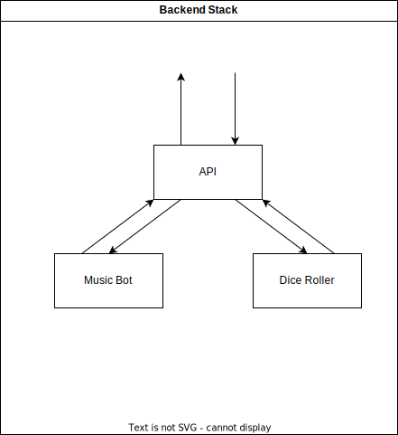

# Backend Stack

## Basic Structure

    The structure of the basic backend stack is that it uses an Express API that is able to communicate with the Modules implemented in the bot

<ul>
    <li> Express API</li>
    <li> Music Player</li>
    <li> Dice Roller </li>
</ul>

### UML Diagram

    </img>
    
 <strong>Figure 1:</strong> Basic Backend Encapsulated Structure

## API

## Modules

### Music Module

### Dice Roller Module